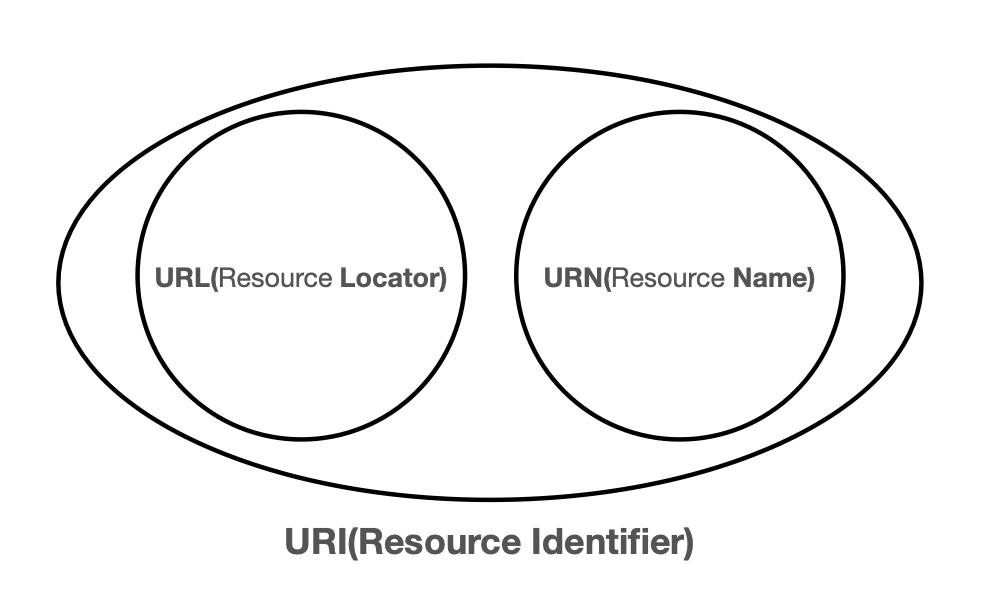
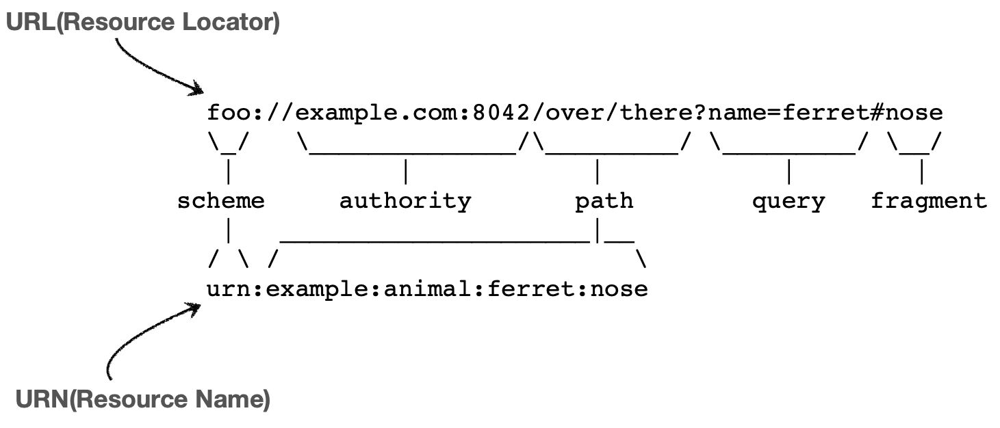

# Express

## [Express](https://expressjs.com/ko/) 란

Node.js를 위한 빠르고 간결한 웹 프레임워크

- Node.js를 이용하여 쉽게 웹 서버를 만들 수 있도록 도와주는 프레임워크
- Node.js의 http 모듈을 사용하여 웹 서버를 만드는 것보다 훨씬 쉽고 간결하게 웹 서버를 만들 수 있음
  - http 모듈을 사용하여 웹 서버를 만드는 것은 매우 복잡하고 번거로움
- express 외에도 koa, hapi, fastify 등의 프레임워크가 있지만 express가 가장 많이 사용됨

### 설치

  ```bash
  npm install express
  ```

### Hello World

  ```js
  const express = require('express');
  const app = express();
  const port = 3000;

  app.get('/', (req, res) => {
    res.send('Hello World!');
  });


  app.listen(port, () => {
    console.log(`Example app listening at http://localhost:${port}`);
  });
  ```

- 위 처럼 간단하게 웹 서버를 만들 수 있다.
- 개발환경에서는 [nodemon](https://www.npmjs.com/package/nodemon)을 사용하여 서버를 실행하는 것이 편리하다.
  - nodemon은 소스코드가 변경될 때마다 자동으로 서버를 재시작해주는 도구이다.
  - nodemon을 설치하고 `nodemon app.js` 명령어로 서버를 실행하면 소스코드가 변경될 때마다 서버가 재시작된다.

## URL(Uniform Resource Locator) 구조



- URI는 로케이터(locator), 이름(name) 또는 둘다 추가로 분류될 수 있다.
- URI는 URL과 URN의 상위 개념이다.



- scheme (foo)
  - 주로 프로토콜을 명시한다. (http, https, ftp 등)
  - http는 80, https는 443 포트를 주로 사용, 포트는 생략 가능하다.
- userInfo(사진에서는 생략)
  - URL에 사용자 정보를 포함해서 인증할 수 있다.
  - 거의 사용하지 않는다.
- authority (<example.com:8042>)
  - 주로 호스트를 명시한다.
  - port: (80(http), 443(https) 등)
- path (/over/there)
  - 주로 리소스의 경로를 명시한다.
  - 계층적 구조로 되어 있다.
    - /over/there ...
- query (?name=ferret)
  - 주로 쿼리 파라미터를 명시한다.
  - key=value 형태로 되어 있다.
    - ?name=ferret&color=purple
- fragment
  - 주로 fragment를 명시한다. (#nose)
  - fragment는 서버로 전송되지 않는다.
  - fragment는 클라이언트 측에서만 사용된다.
  - fragment는 서버에 전송되지 않기 때문에 서버에서는 fragment를 인식할 수 없다.

### URL 분석

<https://www.google.com:443/search?q=hello&hl=ko>

- scheme: https
- authority: <www.google.com:443>
  - host: <www.google.com>
  - port: 443
- path: /search
- query: q=hello&hl=ko
- fragment: 없음

## REST API

Representational State Transfer의 약자로, 웹에 존재하는 모든 자원(이미지, 동영상, DB 자원 등)에 고유한 URI를 부여해 활용하는 것을 의미한다.
[이전 문서에서 정리한 내용](https://hhs-organization.gitbook.io/dev-note/dev-note/init-3/react-component#rest-api)

## HTTP Method(CRUD)

CRUD Operation를 수행하기 위한 HTTP Method

- Create: POST
  - POST를 통해 리소스를 생성한다.
  - [POST] /users
- Read: GET
  - GET을 통해 리소스를 조회한다.
  - Read는 복수와 단수를 구분한다.
    - 복수: [GET] /users
    - 단수: [GET] /users/1
- Update: PUT, PATCH
  - PUT과 PATCH의 차이점은 리소스의 전체를 수정하는지, 일부를 수정하는지의 차이이다.
    - PUT: 리소스의 전체를 수정한다.
    - PATCH: 리소스의 일부를 수정한다.
  - [PUT] /users/1
  - [PATCH] /users/1
- Delete: DELETE
  - DELETE를 통해 리소스를 삭제한다.
  - [DELETE] /users/1

## 간단한 express 서버 세팅

```shell
mkdir express-demo-app
cd express-demo-app

touch .gitignore
echo "node_modules" > .gitignore

# 패키지 초기화
npm init -y

# typescript 설치
npm i -D typescript
npx tsc --init

# ESLint 설치
npm i -D eslint
npx eslint --init

# ts-node 설치
npm i -D ts-node

# express 설치
npm i express
npm i -D @types/express

# nodemon 설치
npm i -D nodemon
```

app.ts

```ts
import express from 'express';

const port = 3000;

const app = express();

app.get('/', (req, res) => {
  res.send('Hello, world!');
});

app.listen(port, () => {
  console.log(`Server running at http://localhost:${port}`);
});
```

실행

```shell
npx nodemon app.ts
```
